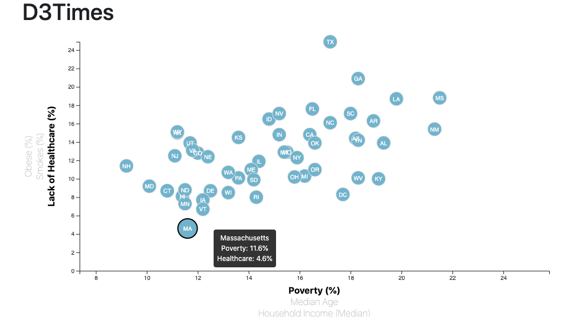

# D3 Homework - Data Journalism and D3

## NOTE
I left the `app2.py` which includes the bonus in the index.html.  To see the first part of the homework simply change `app2.py` to `app.py` and it will show the static chart. 

## Background

The task for this project is to analyze the current trends shaping people's lives, as well as creating charts, graphs, and interactive elements to help readers understand your findings.

Features stories are found by sifting through information from the U.S. Census Bureau and the Behavioral Risk Factor Surveillance System.

The data set included  is based on 2014 ACS 1-year estimates: [https://factfinder.census.gov/faces/nav/jsf/pages/searchresults.xhtml](https://factfinder.census.gov/faces/nav/jsf/pages/searchresults.xhtml). The current data set incldes data on rates of income, obesity, poverty, etc. by state. MOE stands for "margin of error."

### Files in this Repository
1. **D3_data_journalism** the main directory. 
2. **html** and **Javascript** files. 

### Core Assignment: D3 Dabbler (Required Assignment)

A scatter plot between two of the data variables was created such as `Healthcare vs. Poverty` or `Smokers vs. Age`.

Using the D3 techniques, scatter plot was created that represents each state with circle elements. The code for this graphic is in the `app.js` file of this directory—make pulling in the data from `data.csv`  using the `d3.csv` function. Your scatter plot should ultimately appear like the image at the top of this section.

* State abbreviations are included in the circles.

* Axes and labels are created and situated to the left and bottom of the chart.

* Note: `python -m http.server` is used to run the visualization. This will host the page at `localhost:8000` in your web browser.

- - -

### Bonus: Impress the Boss 

D3 lets you interact with your data. 

#### 1. More Data, More Dynamics

This chart include more demographics and more risk factors. Additional labels are added to the scatter plot and have click events so that  users can decide which data to display. Transitions are animated  for your circles' locations as well as the range of your axes. There are three risk factors for each axis.

#### 2. Incorporate d3-tip

Tooltips are used  to reveal a specific element's data when the user hovers their cursor over the element.  Tooltips are added to circles and displayed with the data that the user selects.  The `d3-tip.js` plugin developed by [Justin Palmer](https://github.com/Caged) was used to realize tooltips.

### Summary

The Final Product

* This **new** repository on GitHub called `D3-Challenge` 

* Completion of all steps in the core assignment

* Coherency of scatter plot (labels, ticks)

* Visual attraction

* Professionalism

### Copyright

Ann McNamara © 2020. All Rights Reserved.
